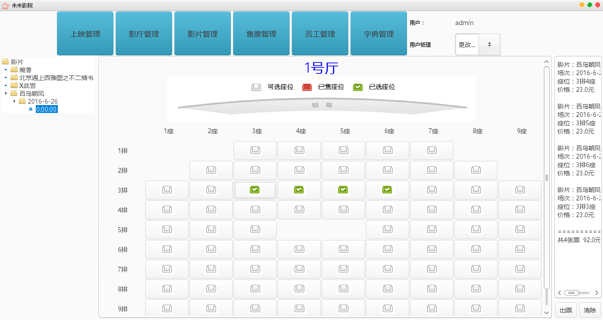

# TTMS (Theater Ticket Management System)

# 一：项目介绍  

`TTMS`全称`剧院票务管理系统`,分为两部分，一个是客户端，一个是服务器端。服务器端可以接收客户端连接请求，客户端相当于  
我们个人PC或者移动终端，通过这套系统我们可以完成对一个影院的票务管理。

服务器端：

客户端：

# 二：使用须知

1：启动MySQL服务器，运行`TTMS_clerk/resource/database/TTMSCreate.sql`,创建数据库，默认为`TTMS`。
2：修改`TTMS_clerk/resource/database/jdbc.properties`中数据库登录用户和密码。
3：运行`TTMS_clerk/resource/database/TTMSInsertData.sql`插入开发测试数据。
4：运行服务器端`TTMS_clerk/src/xupt/se/ttms/main/main.java`，启动服务器
5：客户端连接服务器时候保证`端口`和`IP`是正确的。

# 三：使用的技术

服务器端：界面采用Java Swing 开发，数据库采用MySQL,数据库连接工具采用JDBC，Scoket通信，Json为数据传递格式。

客户端：界面采用Java Swing 开发，Socket通信。

# 四：遇到的问题

1：数据同步问题
2：Json时间格式问题

# 五：待解决的问题
1：数据库中票加锁问题
2：能否用存储过程、数据库连接池等提高服务器效率。
